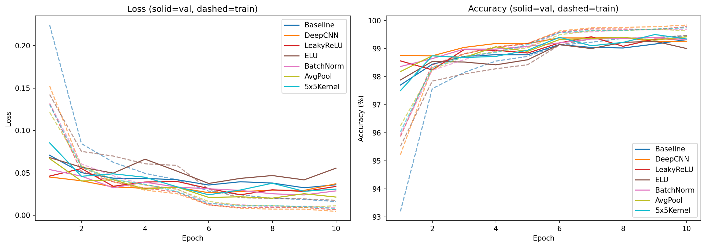
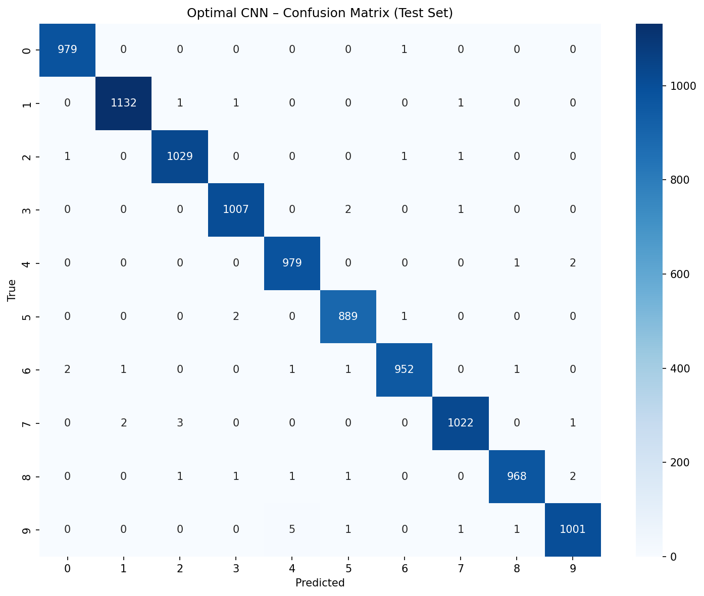
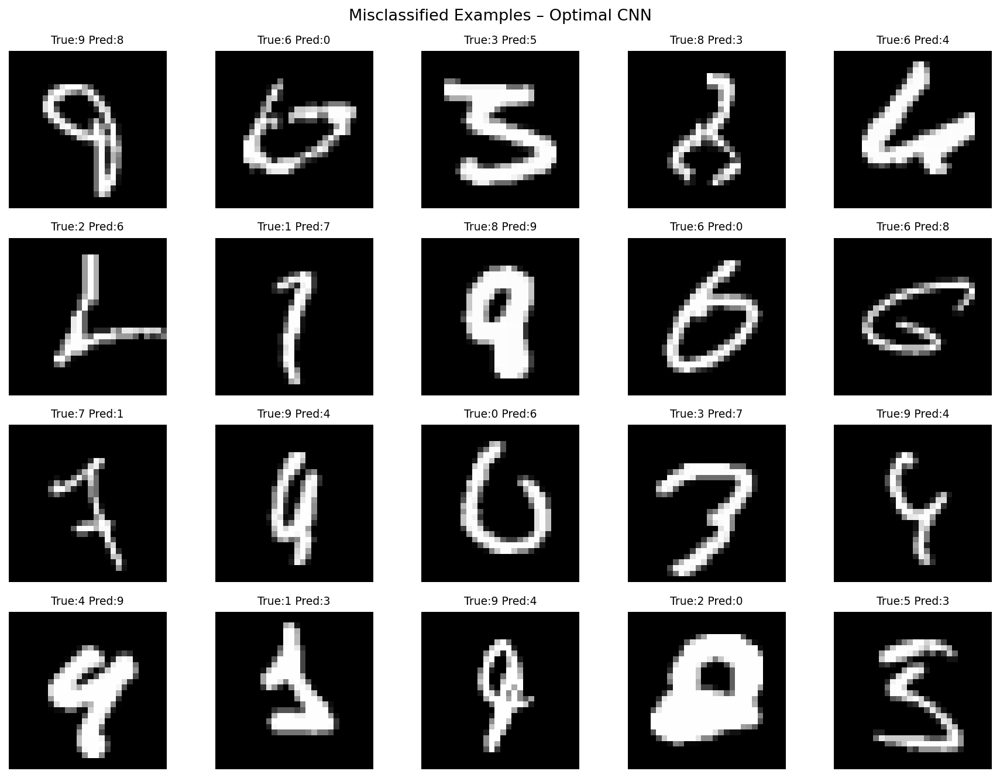
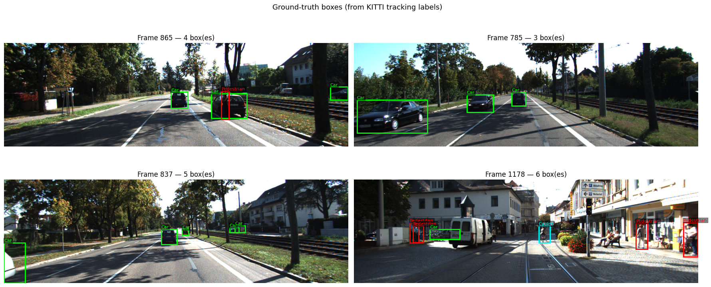

<div align="center">

  <h1>Deep Learning — CNN Classification & Object Detection</h1>
  <p><strong>MNIST digit classification from scratch · KITTI autonomous driving object detection</strong></p>
  <p><em>PyTorch · Faster R-CNN · Evidence-based experimentation · Transfer learning</em></p>

  <br>

  <p>
    <a href="./task1-mnist-cnn/task1_cnn_from_scratch_on_mnist.py">🐍 Task 1 Source</a>
    &nbsp;·&nbsp;
    <a href="./task2-kitti-detection/task2_cnn_for_object_detection_on_kitti.py">🐍 Task 2 Source</a>
    &nbsp;·&nbsp;
    <a href="https://github.com/FakeyeTami/deep-learning-cnn-kitti/issues/new">🐛 Report Issue</a>
  </p>

  <br>


</div>

---

## 📸 Preview

<div align="center">
  
  <br><br>
  
  &nbsp;
  
  <br><br>
  
  <br><br>
  
</div>

---

## What this is

Two complementary computer vision investigations built in PyTorch:

- **Task 1** seven CNN architectures trained and compared systematically on MNIST. One variable changed at a time: depth, activation function, batch normalisation, pooling strategy, filter size. Best model trained to final with data augmentation.
- **Task 2** Faster R-CNN with ResNet-50 FPN backbone fine-tuned for object detection on the KITTI autonomous driving dataset. Two freezing strategies compared. 3D bounding box annotations projected to 2D image space via calibration matrices.

Both tasks follow an evidence-based methodology: hypotheses stated, experiments run, results tabulated, decisions justified.

---

## Results

### Task 1 - MNIST classification

Seven architectures compared. One variable changed per experiment:

| Model          | Best Val Acc | Key change                                           |
| -------------- | ------------ | ---------------------------------------------------- |
| BaselineCNN    | ~99.3%       | 2 conv layers, ReLU, MaxPool                         |
| DeepCNN        | ~99.4%       | Added a 3rd conv layer                               |
| LeakyReLU      | ~99.4%       | Swapped activation to LeakyReLU(0.1)                 |
| ELU            | ~99.3%       | Swapped activation to ELU                            |
| BatchNorm      | ~99.4%       | Added BatchNorm2d after each conv                    |
| AvgPool        | ~99.4%       | Replaced MaxPool with AvgPool                        |
| 5×5 Kernel     | ~99.5%       | First conv uses 5×5 instead of 3×3                   |
| **OptimalCNN** | **~99.6%**   | Dual-block VGG-style + BN + Dropout2d + augmentation |

**Best model:** OptimalCNN, dual-block architecture with BatchNorm, ReLU, MaxPool, Dropout2d, trained for 20 epochs with random affine augmentation.

### Task 2 - KITTI object detection

Two fine-tuning strategies compared on Faster R-CNN with ResNet-50 FPN:

| Strategy                            | Val mAP@0.5 | Mean IoU | Trainable params |
| ----------------------------------- | ----------- | -------- | ---------------- |
| FrozenBackbone (layer4 + head)      | —           | —        | ~8M              |
| FullFineTune (all layers, lower LR) | —           | —        | ~41M             |

Best model selected by validation mAP, then evaluated on a held-out test sequence.

> Actual mAP and IoU values depend on the sequences available in your KITTI dataset copy. The `outputs/` directory contains the results from the original training run.

---

## 🧰 Built With

<div align="center">


&nbsp;
&nbsp;
&nbsp;
&nbsp;
&nbsp;

</div>

---

## Repository Structure

```
deep-learning-cnn-kitti/
├── task1-mnist-cnn/
│   └── task1_cnn_from_scratch_on_mnist.py   // completed Task 1
├── task2-kitti-detection/
│   └── task2_cnn_for_object_detection_on_kitti.py  // completed Task 2
├── outputs/
│   ├── mnist_samples.png              // sample images per class (Task 1)
│   ├── all_experiments_curves.png     // loss/accuracy for all 7 architectures
│   ├── optimal_curves.png             // OptimalCNN training curve
│   ├── optimal_confusion_matrix.png   // confusion matrix for test set
│   ├── misclassified.png              // misclassified examples
│   ├── gt_verification.png            // ground-truth boxes on KITTI frames (Task 2)
│   ├── loss_curves.png                // frozen vs full fine-tune loss
│   └── predictions_vs_gt.png          // predicted vs ground-truth for test sequence
├── requirements.txt
└── README.md
```

---

## Task 1 - Architecture details

### Architectures compared

**BaselineCNN** - the starting point:

```python
Conv(1→32, 3×3) → ReLU → MaxPool
Conv(32→64, 3×3) → ReLU → MaxPool
FC(64×7×7→128) → ReLU → Dropout(0.5) → FC(128→10)
```

**DeepCNN** - one more conv block:

```python
Conv(1→32) → MaxPool → Conv(32→64) → MaxPool → Conv(64→128)
FC(128×7×7→256) → Dropout(0.5) → FC(256→10)
```

**CNNWithActivation** same depth, configurable activation (ReLU / LeakyReLU / ELU)

**CNNWithBatchNorm** adds `BatchNorm2d` after each conv, reduces Dropout to 0.4

**CNNAvgPool** replaces `MaxPool2d` with `AvgPool2d`

**CNNLargeKernel** 5×5 first conv, then 3×3 for remaining layers

**OptimalCNN** best design:

```python
# Block 1
Conv(1→32, 3×3) → BN → ReLU → Conv(32→32, 3×3) → BN → ReLU → MaxPool → Dropout2d(0.25)
# Block 2
Conv(32→64, 3×3) → BN → ReLU → Conv(64→64, 3×3) → BN → ReLU → MaxPool → Dropout2d(0.25)
# Classifier
FC(64×7×7→512) → ReLU → Dropout(0.5) → FC(512→10)
# Training: 20 epochs, Adam lr=1e-3, StepLR, random affine augmentation
```

### Training setup (all experiments)

```python
Optimiser:  Adam, lr=1e-3
Scheduler:  StepLR(step=5, gamma=0.5)
Loss:       CrossEntropyLoss
Batch size: 64
Epochs:     10 (7 experiments) / 20 (OptimalCNN)
Seed:       42 (reproducible splits)
Split:      55,000 train / 5,000 val / 10,000 test
```

---

## Task 2 - Architecture details

### Model: Faster R-CNN with ResNet-50 FPN

Pre-trained on COCO (ImageNet backbone weights). Detection head replaced:

```python
# Original head outputs 91 COCO classes
# Replaced with:
model.roi_heads.box_predictor = FastRCNNPredictor(in_features, num_classes=4)
# num_classes = Background + Car + Pedestrian + Cyclist
```

### Freezing strategies

**Experiment A FrozenBackbone:**

```python
# Freeze entire backbone except layer4
for p in model.backbone.parameters():  p.requires_grad = False
for p in model.backbone.body.layer4.parameters():  p.requires_grad = True
# Optimiser: SGD lr=5e-4, momentum=0.9, weight_decay=1e-4
```

**Experiment B FullFineTune:**

```python
# All parameters trainable
# Lower LR applied to prevent destroying pretrained features
# Optimiser: SGD lr=1e-4, momentum=0.9, weight_decay=1e-4
```

### Data - KITTI sequence-level splitting

```
Split at SEQUENCE level — not frame level.
Consecutive frames within a sequence are near-identical.
Frame-level splitting introduces data leakage and inflates mAP.

Train: qualifying[:-2]   (all sequences except last 2)
Val:   qualifying[-2]    (second-to-last sequence)
Test:  qualifying[-1]    (last sequence — never seen during training)
```

Qualifying sequences must contain all 3 required classes: Car, Pedestrian, Cyclist.

### 3D to 2D box projection

KITTI provides 3D bounding boxes in LiDAR coordinates. Projection pipeline:

```
3D corners (object frame)
    → Rz rotation (heading angle)
    → Translation (tx, ty, tz)
    → Tr_velo_to_cam (LiDAR → camera frame)
    → R_rect (rectification)
    → P2 (camera projection matrix)
    → Divide by z (perspective divide)
    → Clip to [x1, y1, x2, y2] bounding box
```

Boxes with width or height < 4px are discarded.

### Temporal feature stacking

```python
class KITTITemporalDataset(KITTITrackletDataset):
    # Stacks T consecutive frames along the channel dimension: (3*T, H, W)
    # A learned 1x1 conv fuses back to 3 channels before the backbone

class TemporalFasterRCNN(nn.Module):
    # temporal_stem: Conv2d(3*T, 3, kernel_size=1)
    # Gives the model motion context from preceding frames
```

---

## Local Setup

### Prerequisites

```bash
pip install torch torchvision torchmetrics pillow numpy matplotlib seaborn scikit-learn
```

### Task 1 MNIST (no external data needed)

MNIST downloads automatically via torchvision:

```bash
python task1-mnist-cnn/task1_cnn_from_scratch_on_mnist.py
```

Outputs saved to working directory.

### Task 2 KITTI

1. Download from the [official KITTI tracking benchmark](http://www.cvlibs.net/datasets/kitti/eval_tracking.php)
2. Edit `KITTI_ROOT` at the top of the script:

```python
KITTI_ROOT = '/path/to/your/kitti'  # directory containing sequences
```

3. Run:

```bash
python task2-kitti-detection/task2_cnn_for_object_detection_on_kitti.py
```

Expected sequence structure:

```
  KITTI_ROOT/
    calib/
      0000.txt          P0,P1,P2,P3,R_rect,Tr_velo_cam,Tr_imu_velo
      0001.txt
      ...
    data/
      0000/              000000.png, 000001.png, ...
      0001/
      ...
    tracklets/
      0000.txt           one row per object per frame
      0001.txt
      ...
```

---

## Key Concepts

**Task 1:**

- Controlled ablation study one architectural variable changed per experiment
- Batch normalisation, dropout regularisation, data augmentation
- Training/validation/test split with fixed random seed for reproducibility
- Best-model checkpointing, learning rate scheduling (StepLR)
- Confusion matrix and misclassification analysis

**Task 2:**

- Custom `torch.utils.data.Dataset` for structured annotation parsing
- 3D → 2D bounding box projection through calibration matrix pipeline
- Transfer learning with Faster R-CNN and ResNet-50 FPN backbone
- Layer freezing strategies and their effect on detection performance
- Sequence-level data splitting to prevent temporal data leakage
- mAP@0.5 evaluation using `torchmetrics.detection.MeanAveragePrecision`
- Temporal feature stacking for sequential visual data

---

## 🤝 Let's Connect

<div align="center">

[](https://linkedin.com/in/fakeyetami)
&nbsp;[](https://github.com/FakeyeTami)
&nbsp;[](https://tamicodes.dev)
&nbsp;[](mailto:fakeyetami@gmail.com)

</div>

---

<div align="center">
  <sub>Built with stubbornness and attention to detail · University of Sunderland · CET3013 Deep Learning · 2025–2026</sub>
</div>
